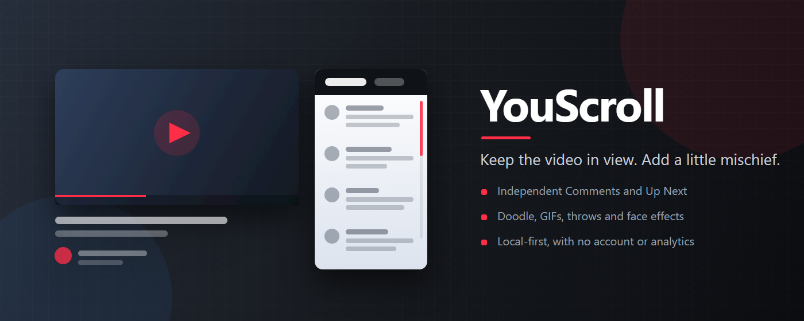

# YouScroll

YouScroll (listed in extension stores as **YouScroll — Scroll Comments & Up
Next Independently**) improves the YouTube watch page while keeping the video
in view. Comments and recommendations share a full-height panel beside the
player and scroll independently. A local Video playground adds doodles, GIFs,
animated throws and face-following effects over the current video.

It is local-first. There is no YouScroll account, analytics service,
advertising SDK or developer-operated data server. The available features make
no network requests and contain no remote code. Settings use Chrome sync;
user-selected GIFs may be saved separately in this browser's local extension
storage. See [PRIVACY.md](PRIVACY.md) for the complete storage and local video
processing details.

This repository hosts YouScroll's public privacy policy, third-party notices
and store listing assets. It does not contain the extension's source code.

## Features

- 📌 Scroll Comments and Up Next in separate panes without moving the player.
  Choose which pane opens first, keep YouTube's own comment loading working as
  you reach the bottom, and avoid a second visible scrollbar gutter.
- 🎨 Open the Video playground directly in Doodle, with a pen, eraser, six colors,
  adjustable size, Undo and Clear all.
- 🎞️ Import local GIFs, drag them over the video and change their size. Up to four
  can play together. Lossless local optimization preserves pixels, resolution,
  frames, timing and transparency, and keeps an already optimized original.
- 💾 Reuse files from Saved GIFs after reloading or delete them individually. The
  library holds up to 12 files and 6 MiB of encoded GIF data. A valid file that
  does not fit still works on the current video.
- 📐 Import GIFs up to 64 MiB and 8 million pixels per frame at their original
  resolution within those practical limits. There is no frame-count or
  animation-duration cutoff.
- 🍅 Throw tomatoes, eggs, slime, confetti, flowers, hearts, stars or snowballs
  with flight arcs, squash and particle bursts that respect reduced-motion
  preferences.
- 😎 Add a moustache, horns, hair, hero mask, pirate patch, red charging Laser
  Eyes or a Super Saiyan power-up with the same red eye glow and a golden body
  aura. Local face landmarks follow position and rotation.
- 🖼️ Import a local PNG, JPEG or WebP as a custom face image, with size and
  placement controls.
- 🪟 Open the current video in the browser's Picture-in-Picture window from a
  button in the player controls.
- ⚡ Toggle each feature from the toolbar popup and apply the change immediately
  in tabs that are already open.

The right-column panel steps aside in theater mode, fullscreen, live chat and
windows too narrow for YouTube's two-column layout. The Play entry remains in
the player controls where supported. Artwork survives same-video mode changes,
and every borrowed page element returns to its original place when a feature
is disabled or the user navigates away.

Face tracking starts only after a face sticker is selected. The bundled model
temporarily processes sampled video pixels on the device; it does not identify
people, upload frames or save face geometry. Tracking may be interrupted by
profiles, occlusion, quick cuts or a video that prevents pixel reads.

## Where it runs

Granted host access is limited to `https://www.youtube.com/*`. YouScroll
requests no access to other sites, other tabs or browsing history. The manifest
retains one optional `http://localhost/*` permission for a deferred Watch
Together prototype. Version 1.0.0 does not expose that feature, request the
permission or connect to a relay.

## Storage and permissions

- `chrome.storage.sync` stores one settings object with feature toggles and the
  preferred panel tab. Chrome may sync it between the user's own signed-in
  browsers; the developer receives no copy.
- `chrome.storage.local` stores only GIF files the user explicitly imports and
  that fit Saved GIFs, plus byte length, a format version and a content hash for
  duplicate detection. Filenames, video identifiers, placements and watch
  history are not stored. Saved GIFs remain on the current browser profile and
  never sync or upload.
- Access to `https://www.youtube.com/*` lets the content script rearrange the
  watch-page layout, add controls and draw extension-owned overlays. A selected
  face sticker temporarily samples the current video's pixels for local
  landmark detection.
- Doodles, throws, on-screen GIF placements, imported face images, sampled
  frames and face geometry remain in tab memory. They are not written to
  storage or transmitted.
- YouScroll requests no `tabs`, `scripting`, `webRequest`, `history`, `cookies`
  or `<all_urls>` permission and has no background service worker.

No comment text, video title, channel name, search query or watch history is
read, logged, stored or transmitted. Extension controls are ordinary elements
in the page, so scripts on that page can see them just as they can see the rest
of the page.

## Documentation

- [Support and issue reporting](ISSUES.md)
- [Privacy policy](PRIVACY.md)
- [Third-party notices](THIRD_PARTY_NOTICES.md)

## Contact

Questions, privacy requests and support: <codecube99@gmail.com>

## License

YouScroll is licensed under the Apache License 2.0. Third-party components
retain their own licenses as listed in
[THIRD_PARTY_NOTICES.md](THIRD_PARTY_NOTICES.md).
